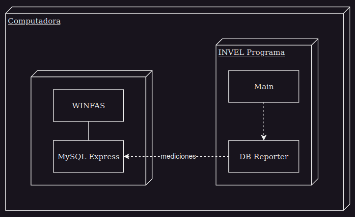

# Deflectometro Plotter

Se trata de un proyecto el cual toma las mediciones realizadas por un Dispositivo Deflectometro, realiza los calculos pertinentes y las grafica.

**Hay una carpeta en drive (la tiene Diego) donde estan los documentos de requerimientos y algunas cosas mas. Ahi hay un PDF donde salen los graficos, las tablas y algunas calculos para mostrar. Tomar eso como guia.**


|Version|Dev|Fecha|
|--------|-------|-----------|
|...|Merino, Mateo| 16/06/2023 |

## Stack
- Python
- Tkinter
- Matplotlib (no se descarta el uso de alguna otra libreria para algun grafico mas complejo)
- MySQL

## Requerimientos

- Los graficos que se necesitan corresponden a: 
  - Deflexion - Prograsivas (mediciones individuales) (LADO IZQUIERDO Y DERECHO SEPARADOS)
  - Radio - Prograsivas (LADO IZQUIERDO Y DERECHO SEPARADOS)

    

  - Deflexion - Progresivas (LADO IZQUIERDO Y DERECHO SEPARADOS)

    

  - Deflexion - Radio (LADO IZQUIERDO Y DERECHO SEPARADOS)
  
    

- Las mediciones corresponden a unas del lado izquierdo y otras del lado derecho.
- Se debe realizar cada grafico dependiendo de a que lado corresponda.
- Los calculos que se deben realizar son *(se supone que nos las van a mandar)*.
- El usuario debe poder ingresar la temperatura antes de comenzar a medir.
- Se debe usar esa temperatura para compensar las mediciones.
- Se debe poder seleccionar 50 o 100 como la cantidad de muestras por grupo.
- Se debe actualizar los graficos y las mediciones a partir de haber obtenido 50 o 100 muestras.
- El grafico de deflexiones individuales debe actualizarse con cada medicion nueva.
- El usuario debe poder ingresar la cantidad total de muestras *(en duda este punto)*. <- el limite se tomaria con respecto al numero de puesto.
- En alguna parte se deben mostrar los siguientes datos.
  
  

- El sistema debe obtener las mediciones a partir de una base de datos en MySQL.
- Debe existir una tabla donde se puedan observar las mediciones y los calculos realizados.
- Los datos deben obtenerse cada 4 segundos aprox *(definir bien con el cliente)*.
- La tabla debe ser:
  
  

- La tabla se actualiza por grupos.
- El usuario debe poder hacer scroll para poder observar todos los graficos y tablas. (decidir si hacer un scoll en la tabla, ya tiene integrado uno, y otro para los graficos o directamente uno para toda la pagina).
- Debe existir un boton que permita generar un PDF con los datos y graficos generados.

- Las madiciones que pertenezcan a un mismo conjunto tienen el mismo numero de puesto.
- Si el numero de puesto cambia significa que dichas mediciones pertenecen a otro conjunto. <- Preguntar si estos se puede dar, cuando y ver como handlearlo.
- Si el numero de puesto cambia, se debe dar posibilidad a generar un informe final.


## Diagramas

La idea es, tomar las mediciones de la base de datos (segun el cliente se ingresan datos cada 4 segundos aprox) y graficarlos. Se deben formar grupos de 50 o 100 dependiendo de lo que elijan y recien ahi hacer los calculos y ploteos.




## Base de datos

Se dispone de una base de datos MySQL con dos tablas. Una que contiene los ciclos y otra donde se almacenan las mediciones de cada ciclo.

*Se puede modificar la base si se necesita de algun campo o tabla extra.*

En la tabla 'mediciones_ciclo' en un mismo ciclo entraran 4 mediciones distintas. Correponden a la deflexion y al radio de la rueda derecha e izquierda. (no tengo claro el orden, ellos lo pueden cambiar a eso).

 ```
 Tabla 'ciclo'
+-------------------+-------------+------+-----+---------+-------+
| Field             | Type        | Null | Key | Default | Extra |
+-------------------+-------------+------+-----+---------+-------+
| nro_puesto        | tinyint     | NO   | PRI | NULL    |       |
| nro_ciclo         | int         | NO   | PRI | 0       |       |
| codigo_prog       | smallint    | NO   |     | 0       |       |
| fecha_hora_inicio | datetime    | YES  |     | NULL    |       |
| fecha_hora_final  | datetime    | YES  |     | NULL    |       |
| distancia_inicio  | bigint      | YES  |     | NULL    |       |
| distancia_final   | bigint      | YES  |     | NULL    |       |
| operario          | varchar(50) | YES  |     | NULL    |       |
| turno             | varchar(15) | YES  |     | NULL    |       |
| utilizar_en_estad | tinyint     | NO   |     | 0       |       |
| campos_extra      | text        | YES  |     | NULL    |       |
| nro_lote          | varchar(15) | YES  |     | NULL    |       |
+-------------------+-------------+------+-----+---------+-------+


Tabla 'mediciones_ciclo'
+--------------+---------+------+-----+---------+-------+
| Field        | Type    | Null | Key | Default | Extra |
+--------------+---------+------+-----+---------+-------+
| nro_puesto   | tinyint | NO   | PRI | 0       |       |
| nro_ciclo    | int     | NO   | PRI | 0       |       |
| nro_medicion | tinyint | NO   | PRI | 0       |       |
| valor        | float   | NO   |     | 0       |       |
+--------------+---------+------+-----+---------+-------+
 ```
